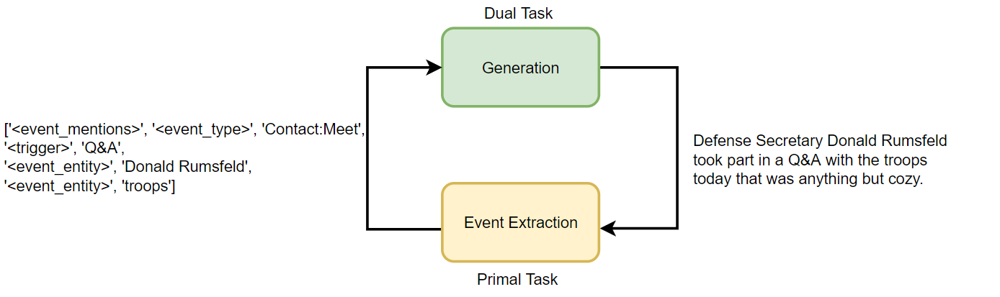
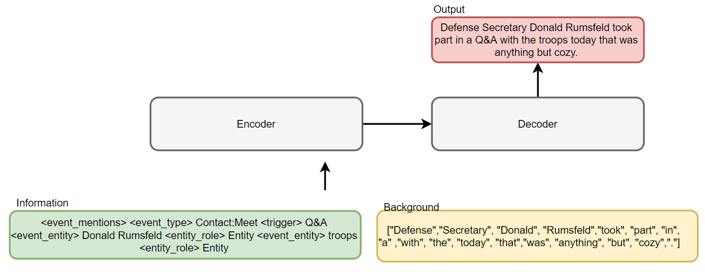
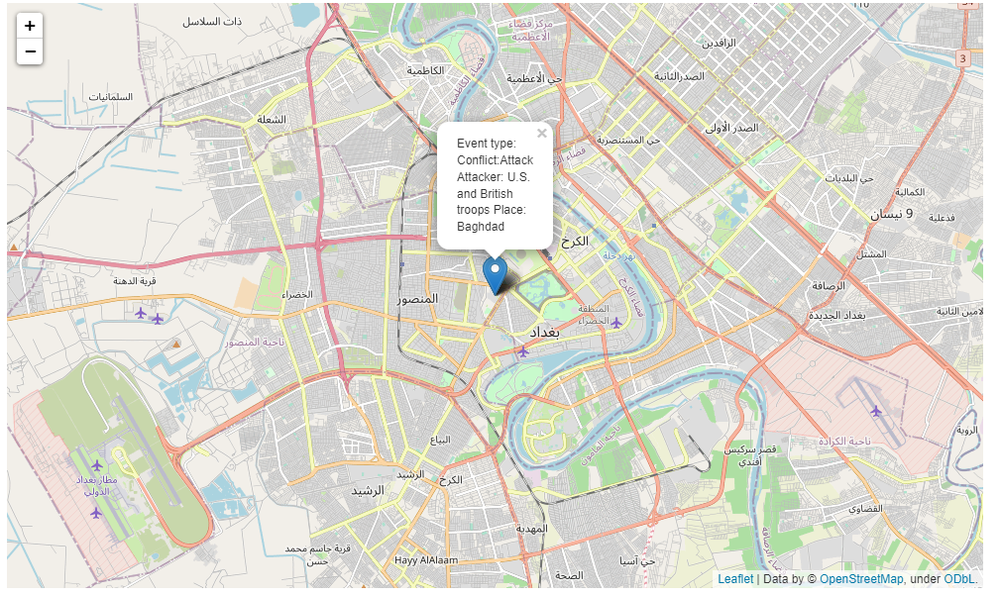

# News Monitoring System Based on Event Extraction and Data-to-Text Generation

- Proposed a dual learning algorithm that treats event extraction and text reconstruction as dual tasks and trained both models.

- Used T5 as a generation model to generate pseudo data from structured event information to train the event extraction model, and applied the [GTEE-base](https://arxiv.org/abs/2205.06166) model as the baseline event extraction model.

- Added reinforcement learning-based and BLEU score-based policy gradient method to the event extraction model's objective to opitimize the model results and achieved SOTA an the ACE05-E, ACE05-E+ and ERE-EN datasets.

- Created a interface of the system.

